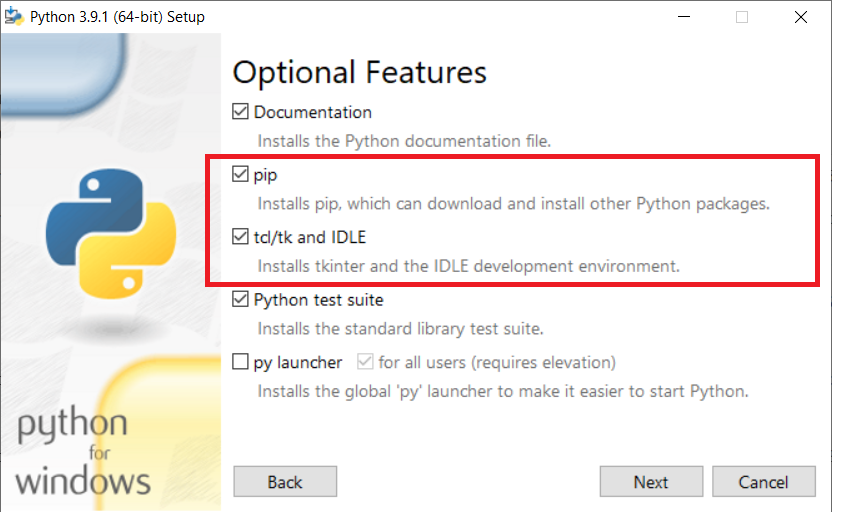
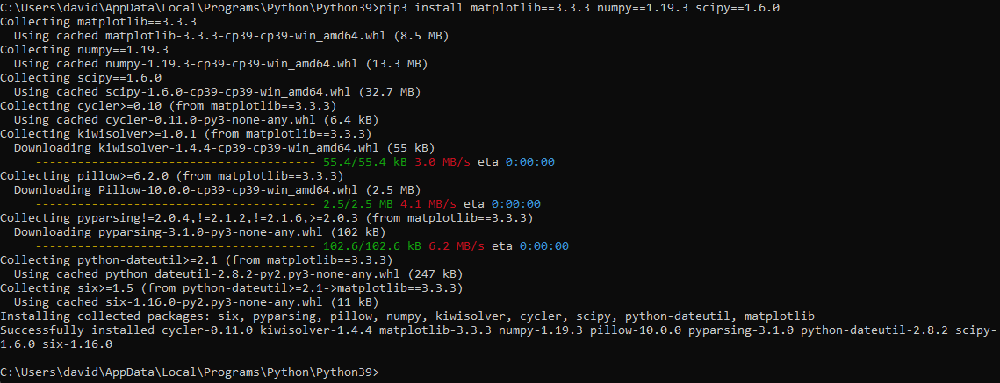
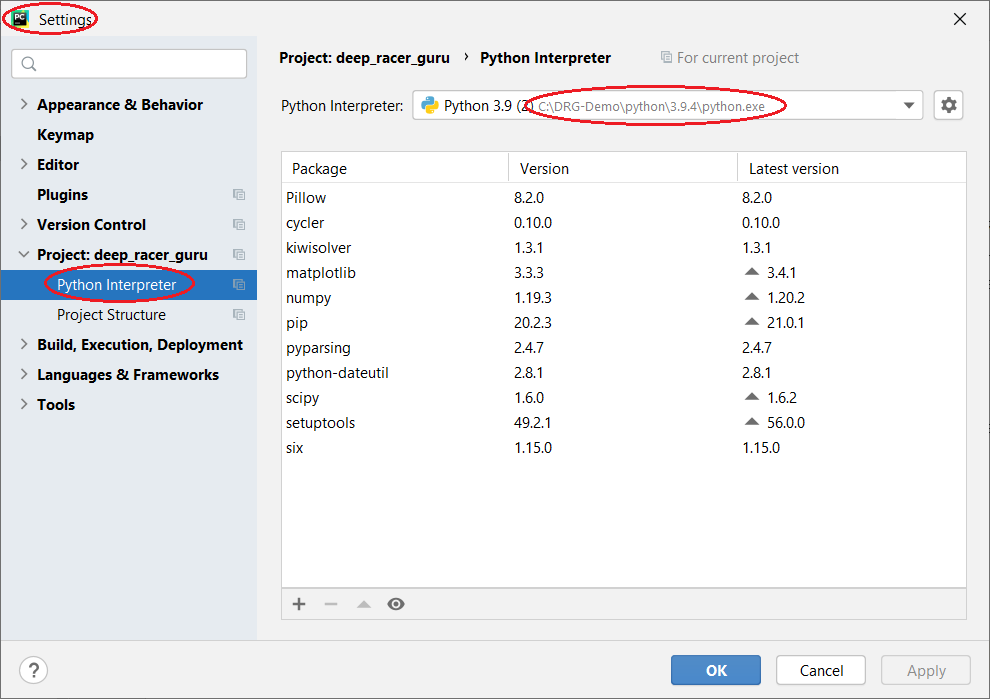
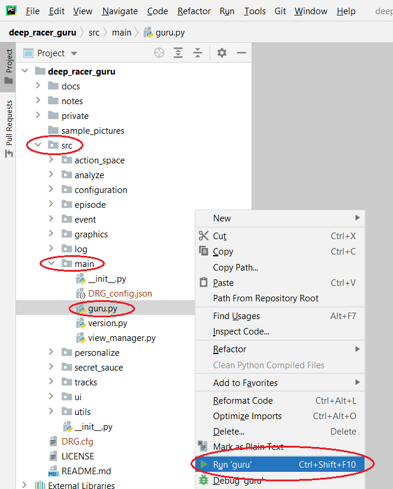

# Installation Instructions

## Install Python
Download and install [Python 3.9.13](https://www.python.org/downloads/release/python-3913/)

Note - If you change the install options, be sure you still install *pip* and *tkinter*:

## Install Additional Python Packages

Download additional packages by running this command in the directory where you just installed Python:

    python -m pip install matplotlib==3.3.3 numpy==1.19.3 scipy==1.6.0
    
For example:

## Download Deep Racer Guru

Either:
* Download the latest release zip file from the [Releases section](https://github.com/dmh23/deep_racer_guru/releases) of Github
* Unzip the entire contents of the zip file into a convenient location

Or: (NOT RECOMMENDED CURRENTLY DUE TO ISSUES IN CODE MERGING)
* Git "clone" the [Source code](https://github.com/dmh23/deep_racer_guru) directly from Github

## Launch Deep Racer Guru
### Manual Launch

Run it manually using the following example commands:

    cd C:\DRG-Demo\projects\deep_racer_guru
    C:\DRG-Demo\python\3.9.13\python.exe -m src.main.guru

Note:
* You must "cd" to the root directory/folder where you unzipped or cloned the Deep Racer Guru code
* If you are in the right place, it contains the __README.md__ file and several sub-directories/folders including __src__
* Make sure you are running exactly the copy of Python that was installed in the previous steps (check the path carefully)
* Obviously you may want to create a simple batch/shell script for this

### Using an IDE

Configure the IDE to use the version of Python interpreter that you installed in the previous steps.

As an example, here is a screenshot from PyCharm:

Then you can simply "run" the main application from the __src/main/guru.py file__

Again as an example, here is a screenshot from PyCharm:

